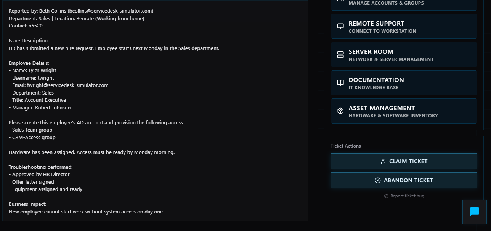
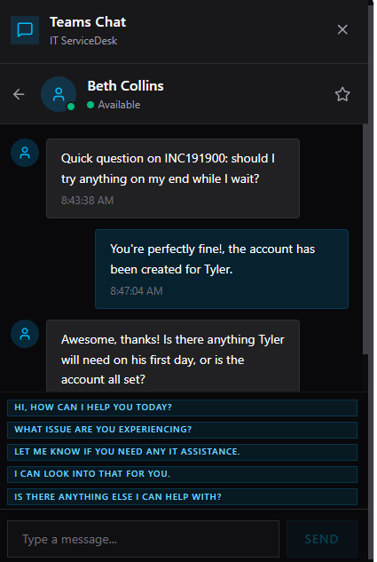
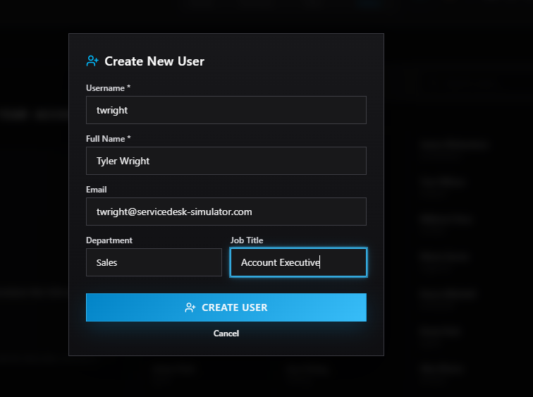
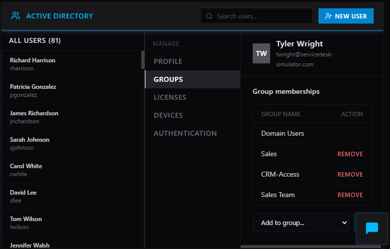
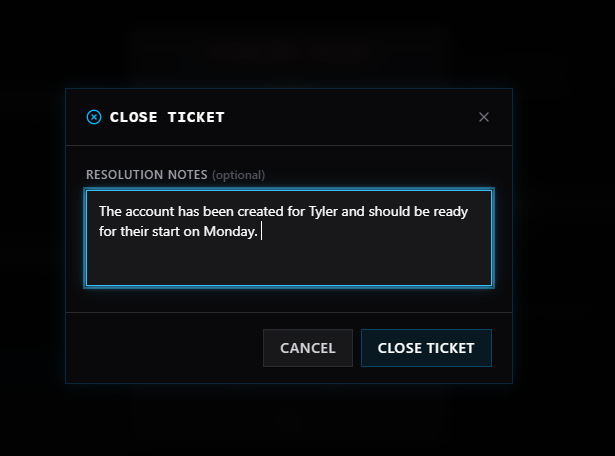

# Ticket: New User Onboarding & Account Provisioning

## 📌 Overview

Simulated service desk ticket involving onboarding a new employee and provisioning system access.

## 🎯 Objective

Create a new user account and assign appropriate permissions before start date.

## 📝 Ticket Details

* Issue: New employee onboarding request
* Priority: Medium
* Department: Sales
* Access Required: Teams group and CRM system

## 🔍 Steps Taken

1. Reviewed HR onboarding request and verified approval
2. Created new user account in Active Directory
3. Assigned appropriate group memberships (Sales Team, CRM access)
4. Verified account configuration and permissions
5. Ensured system access readiness before start date
6. Documented completion of onboarding process

## ✅ Result

User account successfully created and configured with required access. Employee prepared for first day without delays.

## 🧠 Skills Demonstrated

* User account provisioning
* Access control & permissions
* Active Directory management
* Following onboarding procedures
* Attention to detail

## 📸 Screenshots

